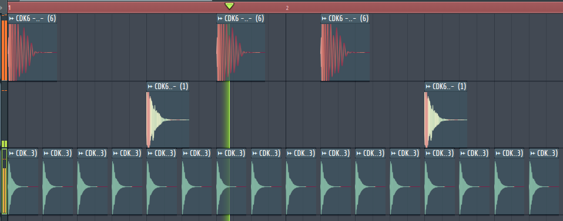

# Драмка и построение бита

## Самые важные звуки в бите

Драмка (ударные) — это ритмический фундамент любого трека. Без правильной драмки бит не будет «бить».

### Кик (Kick)

Бочка — самый низкочастотный элемент бита. Кик задаёт пульсацию и определяет, будет ли бит «тяжёлым» или «лёгким».

### Снейр (Snare) и Клэп (Clap)

Снейр — акцентный удар, обычно приходится на 2-й и 4-й счёт в такте. Клэп часто используется как дополнение или замена снейру.

### Хэт (Hi-Hat)

Хэты заполняют пространство между киком и снейром, создавая движение и энергию.

## Частотный диапазон драмки

| Диапазон | Частоты | Что находится |
|----------|---------|---------------|
| **Низ (Low)** | 20-200 Гц | Кик, суб-бас, тело удара |
| **Середина (Mid)** | 200-2000 Гц | Тело снейра, атака кика |
| **Верх (High)** | 2000-20000 Гц | Шипение хэтов, клики, воздух |

!!! important
    Понимание частотных диапазонов критично: кик живёт внизу, снейр — в середине, хэты — наверху. Если звуки «живут» на одних частотах, они будут конфликтовать.

## Channel Rack в FL Studio

**Channel Rack** — рабочее окно в FL Studio, где вы размещаете звуки и программируете паттерны.

- Каждый канал — отдельный звук (кик, снейр, хэт)
- Шаг-секвенсор позволяет расставлять удары по сетке
- Паттерны можно комбинировать и повторять

## Расстановка ударки

### Стандарты в построении и темп

### MIDI заготовки и паттерны

Используйте готовые MIDI-паттерны как отправную точку, затем адаптируйте под свой стиль.

### Повторение треков по драмке

Создайте базовый паттерн на 1-2 такта, затем повторяйте его в плейлисте, добавляя вариации.

## Кач (Groove)

**Кач** — это ощущение движения, заставляющее вас хотеть двигаться под музыку.

### движение головы и ног

- Кач создаётся не только расстановкой ударов, но и их **таймингом**
- Сдвиг ударов на несколько миллисекунд от сетки («swing») добавляет живости
- Экспериментируйте с позицией кика — это меняет характер бита

## Луп драмки

**Луп** — повторяющаяся секция драмки. Хороший луп:

- Звучит естественно при зацикливании
- Имеет динамику (не монотонный повтор)
- Оставляет пространство для мелодии и баса

---

## Задание

  

    Практика
    <h3 class="potok-challenge__title">Паттерн на 4 бара</h3>
  

  

    
Собери короткий драм-паттерн и сохрани проект — без мелодии и баса.

  

  <ol class="potok-challenge__steps">
    <li>Kick на 1 и 3 (или свой groove).</li>
    <li>Snare / clap на 2 и 4.</li>
    <li>Hi-hat: восьмые или шестнадцатые, можно velocity.</li>
    <li>Длина — ровно 4 бара. Сохрани как <code>etap1-drum-4bar</code>.</li>
  </ol>
  
Не гонись за сложностью. Цель — устойчивый groove, который можно зациклить.

  

    <button type="button" class="potok-challenge__btn"
      data-challenge-toggle
      data-todo-label="Отметить выполненным"
      data-done-label="Сделано">Отметить выполненным</button>
    
  

---

**← [Назад: Что такое сэмпл](che-takoe-sampl.md)** | **[Далее: Подбор сэмплов и структура бита →**](podbor-samplow.md)
