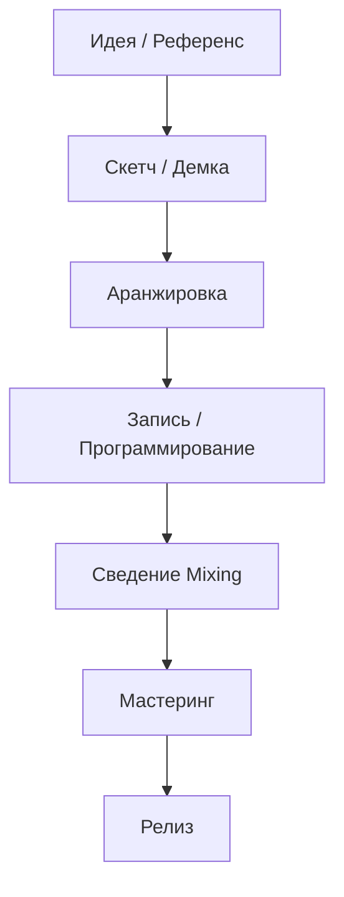

<h1>Этап №2</h1>

Профессиональный саунд: EQ, компрессия, сатурация, реверб, delay, мастеринг, работа с референсами.

<i data-lucide="equalizer" class="icon"></i> EQ
<i data-lucide="gauge" class="icon"></i> Компрессия
<i data-lucide="sparkles" class="icon"></i> Сатурация
<i data-lucide="radio" class="icon"></i> Реверб
<i data-lucide="repeat" class="icon"></i> Delay
<i data-lucide="disc-3" class="icon"></i> Мастеринг

# Зачем сведение?

Теперь, когда вы понимаете основы звука и теорию музыки, пришло время
перейти к **практике** — реальному созданию треков.

В этом разделе мы разберём:

1. Сведение (mixing) — балансировка всех элементов
2. Мастеринг — финальная обработка для релиза

!!! important
    Практика — это 90% успеха. Теория без практики бесполезна.
    После каждой главы открывайте DAW и пробуйте.

## Workflow создания трека

---

**← [Назад: Этап №1 →](../etap1/final-etap1.md)** | **[Далее: Основные понятия →](osnovnye-ponyatiya.md)**
