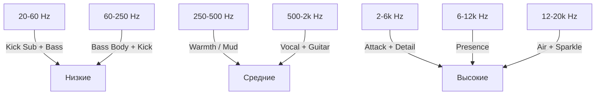

# Сведение (Mixing)

Сведение — это процесс балансировки всех элементов трека в единое
целое. Хороший микс звучит хорошо на любой системе воспроизведения.

## Цели сведения

1. **Баланс** — каждый элемент слышен, ничего не «давит»
2. **Чёткость** — нет «мути», каждый инструмент в своём частотном диапазоне
3. **Пространство** — реверберация и задержка создают глубину
4. **Динамика** — контроль громкостей во времени

## Основные инструменты сведения

### 1. Эквалайзер (EQ)

EQ позволяет усиливать или ослаблять определённые частоты.

| Тип EQ | Применение |
|--------|-----------|
| **Low-pass (High-cut)** | Убирает высокие частоты |
| **High-pass (Low-cut)** | Убирает низкие частоты |
| **Bell (Пиковый)** | Усиливает/ослабляет диапазон |
| **Shelf (Полочный)** | Усиливает/ослабляет всё выше/ниже точки |

!!! tip
    **Золотое правило EQ:** режьте, а не усиливайте.
    Если бас «мутный» в 200 Гц — срежьте 200 Гц, а не усиливайте 400 Гц.

### 2. Компрессор

Компрессор уменьшает динамический диапазон — делает тихие звуки громче,
громкие — тише.

| Параметр | Описание | Типичное значение |
|----------|---------|-------------------|
| **Threshold** | Порог срабатывания | -20 dB |
| **Ratio** | Степень сжатия | 4:1 |
| **Attack** | Время срабатывания | 10–30 мс |
| **Release** | Время восстановления | 100–300 мс |
| **Makeup Gain** | Компенсация громкости | По слуху |

### 3. Реверберация и задержка

| Эффект | Применение | Decay (хвост) |
|--------|-----------|---------------|
| **Reverb (Room)** | Ощущение пространства | 0.8–1.5 с |
| **Reverb (Hall)** | Величие, масштаб | 2–5 с |
| **Delay** | Глубина, движение | 0.3–1.5 с (зависит от BPM) |
| **Chorus** | Ширина, «толщина» | 20–50 мс |

## Частотная карта микса

## Чек-лист сведения

- [ ] High-pass фильтр на всех треках, кроме kick и bass
- [ ] Баланс громкости всех элементов (без плагинов, только faders)
- [ ] EQ — удаление проблемных частот
- [ ] Компрессия — контроль динамики
- [ ] Реверберация — создание глубины
- [ ] Automation — движение во времени
- [ ] A/B с референсным треком
- [ ] Проверка на разных системах (наушники, мониторы, телефон)

---

**← [Назад: Психоакустика](psychoacoustics.md)** | **[Далее: Мастеринг →](mastering.md)**
