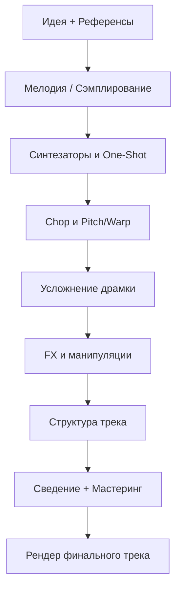

<h1 class="unbounded">Этап №3</h1>

<i data-lucide="sliders-vertical" class="icon"></i> Синтезаторы
<i data-lucide="scissors" class="icon"></i> Chop-техники
<i data-lucide="activity" class="icon"></i> Драм-партии
<i data-lucide="zap" class="icon"></i> FX
<i data-lucide="layout-template" class="icon"></i> Структура
<i data-lucide="music-2" class="icon"></i> Жанры

# Усложненные биты

Вы научились создавать простые биты и работать с базовыми инструментами сведения. Теперь пришло время **усложнить** ваши продакшны.

В этом этапе мы разберём:

1. Написание мелодий с нуля и работа с синтезаторами
2. Chop-техники и сэмплирование
3. Усложнение драм-партии
4. BoomBap, Rock и жёсткие биты
5. FX-обработки и манипуляции
6. Структура трека
7. Мастеринг и спидран-фишки

!!! important
    **Этот этап — переход от новичка к уверенному продюсеру.** Каждая тема требует практики. Не проходите мимо — открывайте DAW после каждой главы.

## Workflow усложнённого бита

---

**← [Назад: Этап №2 →](../etap2/index.md)** | **[Далее: Первая мелодия →](pervaya-melodiya.md)**