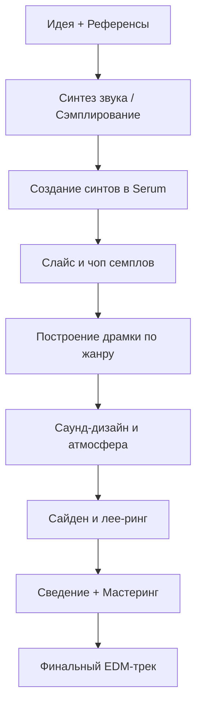

# Этап №5 — EDM и Саунд-дизайн

Электронная музыка — это **искусство создания звука с нуля**. От синусоиды до дропа, от сэмплирования до модульного синтеза — в этом этапе вы освоите мир EDM-продакшна и саунд-дизайна.

## Что в этом этапе

### <i data-lucide="sliders-horizontal" class="heading-icon"></i> Синтез Звука
1. **Основа любого звука** — wavetable, формы волны, Serum
2. **Wavetable и синтезаторы** — ADSR, фильтры, LFO, FX
3. **Лееринг синтов** — атмосфера, текстура, уникальность
4. **FX в синтах** — VST-обработка внутри синтезатора

### <i data-lucide="scissors" class="heading-icon"></i> Сэмплирование
5. **Slice и Chop** — мелодия, драмка, ритм, лупы
6. **VST чоперы и слайсеры** — Serato Sample, Fruity Slicer, Sampler Ableton

### <i data-lucide="headphones" class="heading-icon"></i> Базовые жанры EDM
7. **House** — прямая бочка, сайдчейн, ambient house
8. **DnB** — 174 bpm, риз бас, neurofunk
9. **Dubstep** — 140 bpm, дроп, структура

### <i data-lucide="ghost" class="heading-icon"></i> Стили и продюсеры
10. **Crystal Castles** — крипота, пространство, андерграунд
11. **Атмосферный EDM** — глитчи, жир, импровизация
12. **2hollis** — битовый кач, перегруз, арпеджиаторы
13. **DeathStep / Fatal-M** — дисторшн, атмосфера, стиль

### <i data-lucide="puzzle" class="heading-icon"></i> Саунд-дизайн
14. **Философия подхода** — линейный, итеративный, модульный, творческий
15. **Основы саунд-дизайна** — акустика, теория, синтез, сэмплинг
16. **Материалы** — сервисы, книги, ресурсы

### <i data-lucide="mic-vocal" class="heading-icon"></i> Практика
17. **Работа с референсами** — повторение синтеза, пресеты, AI
18. **Фишки сведения и Мастера** — OTT, сайдчейн, лимитер, Ear Candy
19. **Ремиксы треков** — акапеллы, темп, тональность, хаус-версии

!!! important
    **Этот этап — мост между битмейкингом и профессиональным EDM-продакшном.** Каждая тема требует практики в DAW. Экспериментируйте с синтезаторами, анализируйте референсы, создавайте свои звуки.

## Workflow EDM-продакшна

---

**← [Назад: Этап №4 →](../etap4/index.md)** | **[Далее: Синтез Звука →](sintez-zvuka.md)**