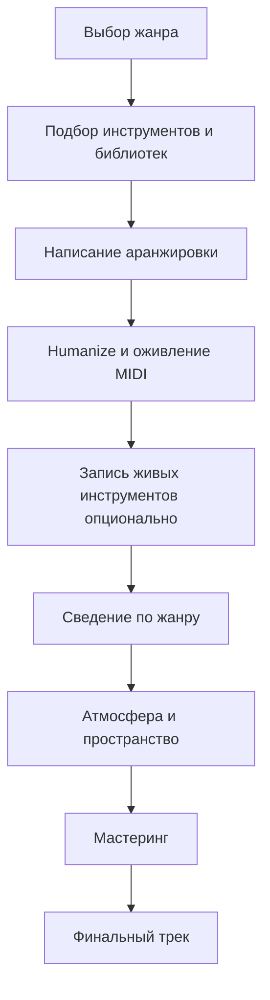

<h1>Этап №6</h1>

Вы освоили битмейкинг и сведение. Теперь пришло время выйти за рамки электроники и освоить живые инструменты.

<i data-lucide="guitar" class="icon"></i> Рок
<i data-lucide="heart-crack" class="icon"></i> Пост-Панк
<i data-lucide="clouds-rain" class="icon"></i> Гранж
<i data-lucide="hand" class="icon"></i> Метал
<i data-lucide="horn" class="icon"></i> Джаз

# Этап №6 — Живая Музыка

Вы освоили битмейкинг, сведение и сложные продакшн-техники. Теперь пришло время выйти за рамки электроники и освоить **живые инструменты**.

В этом этапе мы разберём работу с реальными инструментами через VST и запись:

## Что в этом этапе

### <i data-lucide="guitar" class="heading-icon"></i> Рок
1. **Основные инструменты** — гитара, бас, драмка: роль каждого в роке
2. **Вариации жанра** — рок нулевых, shoegaze: особенности звучания
3. **Написание с нуля** — подбор библиотеки, гитары, драмка, гармония, структура
4. **Оживление VST** — velocity, humanize, выбор библиотеки, типичные ошибки
5. **Сведение рока** — гитары (кранч/клин, хорус), драмка (плотность, пространство), бас, мастер

### <i data-lucide="heart-crack" class="heading-icon"></i> Пост-Панк
6. **Основные элементы** — гитары, мелодии, драмка, электроника
7. **Атмосферность** — создание мрачной атмосферы
8. **Влияние Панка** — энергия и минимализм
9. **Сведение** — реверб и атмосфера как основа

### <i data-lucide="clouds-rain" class="heading-icon"></i> Гранж
10. **Гаражный звук** — сырой, грязный характер гранжа
11. **Плагины и Сэмпл паки** — инструменты для гранж-продакшна
12. **Модуляционные обработки** — дисторшн, хорус, фазер
13. **Энергетика** — холод, сырость, эмоциональное напряжение

### <i data-lucide="hand" class="heading-icon"></i> Метал
14. **Написание с нуля** — живая гитара, низкий строй, библиотеки (Shreddage 3, Session Guitarist), бас, драмка (Perfect Drums)
15. **Сведение** — гитары (стерео, плотный низ, 3-4 кГц), драмка (комната, кранч, лееринг, Distressor), параллельные обработки
16. **Жанры** — Argent Metal (синты + метал), Nu-Metal и Core

### <i data-lucide="horn" class="heading-icon"></i> Джаз
17. **Основные инструменты** — клавиши, трубы, дабл бас, драмка
18. **Написание с нуля** — джазовые прогрессии (ii-V-I, ступени 7-9-11-13), мягкий звук, импровизация
19. **Вариации жанра** — Noir Jazz, быстрый и фанковый джаз

### <i data-lucide="mic" class="heading-icon"></i> Работа с реальными инструментами
20. **Запись** — микрофон, гитары (провод, звуковуха), шум (заземление), FL Studio и Ableton

!!! important
    **Этот этап — переход от битмейкера к полноценному продюсеру.** Работа с живыми инструментами открывает совершенно новые возможности. Практикуйте запись и сведение после каждой главы.

## Workflow живого продакшна

---

**← [Назад: Этап №3 →](../etap3/index.md)** | **[Далее: Рок — Основные инструменты →](rock-osnovnye-instrumenty.md)**