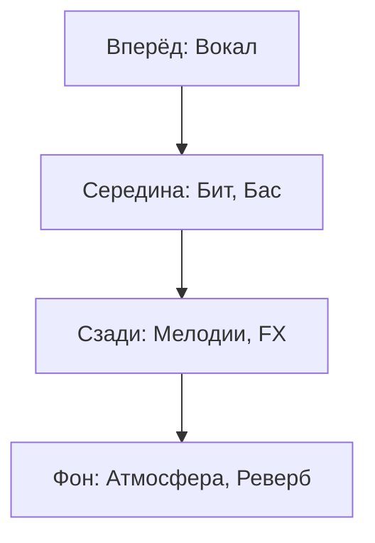

# Финальный чек микса и Мастеринг

Последний этап перед рендером: проверка баланса, мастеринг, сверка с референсом.

## Общая группа с вокалом

### Компрессия на вокальной группе

| Параметр | Значение |
|----------|---------|
| **Ratio** | 2:1 to 3:1 |
| **Attack** | 10-30 мс |
| **Release** | Авто |
| **Gain Reduction** | 1-3 dB |

### Soothe2 на группе

| Настройка | Эффект |
|-----------|--------|
| **Learning mode** | Автоматический анализ резонансов |
| **Strength 30-60%** | Убирает проблемные частоты без потери характера |
| **Low end protection** | Не трогайте ниже 200 Гц |

### План голоса и трека

| Элемент | Позиция |
|---------|---------|
| **Вокал** | Вперёд, по центру |
| **Бэки** | Сзади, широко |
| **Бит** | Под вокалом, поддержка |
| **Мелодии** | За битом, атмосфера |

### Расположение микса

## MID-SIDE обработка

### Что такое MID-SIDE

| Канал | Содержит |
|-------|---------|
| **MID (Centre)** | Вокал, кик, бас, снейр — всё по центру |
| **SIDE (Sides)** | Гитары, бэки, реверб, ширина — всё по бокам |

### Применение MID-SIDE

| Цель | Как сделать |
|------|-----------|
| **Выделить вокал** | Boost MID в 1-3 кГц, cut SIDE в том же диапазоне |
| **Добавить ширину** | Boost SIDE выше 10 кГц |
| **Контроль низа** | Low-pass на SIDE ниже 200-300 Гц (низ только в центре) |
| **Чистота центра** | Soothe2 на MID для удаления резонансов |

## Основной чек перед рендером

### Сидит ли вокал?

| Проверка | Что слушать |
|----------|-----------|
| **Пространство** | Вокал не тонет в ревербе? |
| **Громкость** | Вокал слышен на фоне бита? |
| **Компрессия** | Динамика под контролем? |

### Пространство MID и SIDE

| Проверка | Критерий |
|----------|---------|
| **Мониторинг на моно** | Вокал и бит слышны чётко |
| **Стерео-изображение** | Ширина не «раздувает» микс |
| **Глубина** | Слои разнесены по глубине |

### Мастер

| Параметр | Целевое значение |
|----------|-----------------|
| **LUFS (интеграл)** | -14 LUFS (YouTube/Spotify), -8 to -10 LUFS (клуб) |
| **True Peak** | -1 dBTP |
| **Динамический диапазон** | 6-12 dB (по жанру) |

### Громкость по LUFS

| Платформа | Рекомендация |
|-----------|-------------|
| **Spotify** | -14 LUFS (нормализация) |
| **YouTube** | -14 LUFS (loudness rating) |
| **Apple Music** | -16 LUFS |
| **Клуб / DJ** | -8 to -6 LUFS |

### Чек на разных устройствах

| Устройство | Что проверять |
|-----------|--------------|
| **Студийные мониторы** | Общий баланс, частоты |
| **Наушники** | Детали, стерео-изображение |
| **Телефон / колонка** | Низкие частоты, читаемость |
| **Магнитола** | Громкость, компрессия |

### Сверяемся с референсом

1. **Загрузите референс** в тот же проект
2. **Сравните громкость** (сведите референс к тому же уровню)
3. **Сравните спектр** через анализатор
4. **Сравните стерео-изображение** через стерео-метр

---

**← [Назад: Сведение с битом](svedenie-s-bitom.md)** | **[Далее: Работа с референсами →](referensy-i-stream.md)**
