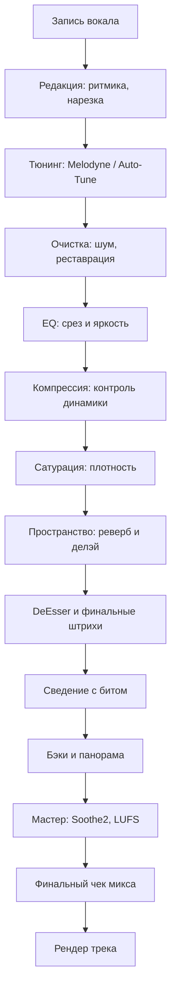

# Этап №7 — Сведение Вокала и Мастеринг

<h1>Этап №7</h1>

Профессионально работайте с вокалом — записывайте, обрабатывайте и сводите голос с треком.

<i data-lucide="mic" class="icon"></i> Запись вокала
<i data-lucide="scissors" class="icon"></i> Редакция
<i data-lucide="sliders-horizontal" class="icon"></i> Обработки
<i data-lucide="users" class="icon"></i> Бэки
<i data-lucide="bar-chart-3" class="icon"></i> Мастеринг

# Этап №7 — Сведение Вокала и Мастеринг

Вы освоили создание битов, работу с живыми инструментами и базовое сведение. Теперь пришло время **профессионально работать с вокалом** — записывать, обрабатывать и сводить голос с треком.

В этом этапе мы разберём полный пайплайн вокала: от записи до финального мастеринга.

## Что в этом этапе

### <i data-lucide="mic" class="heading-icon"></i> Запись вокала
1. **Как записываться на микрофон** — подготовка, техника, настройка уровня
2. **Выбор микрофона** — какие микрофоны подходят для вокала и их установка

### <i data-lucide="scissors" class="heading-icon"></i> Редакция вокала
3. **Ритмика и нарезка** — попадание по сетке, автоматизация громкости
4. **Тюнинг** — Melodyne, Auto-Tune, настройка скорости тюна
5. **Очистка звука** — RX 11, AI-сервисы, работа с шумом

### <i data-lucide="sliders-horizontal" class="heading-icon"></i> Основные обработки
6. **EQ** — срез ненужных частот, яркость, динамическая эквализация
7. **Компрессия** — Distressor, 1176, LA2A, групповая компрессия
8. **Сатурация** — плотный вокал, кранч, дополнительная компрессия
9. **Реверберация** — пространство, return-сенды, несколько реверов
10. **Делэй** — уплотнение, tempo-sync, ping-pong, фильтры
11. **Хорус / Даблер** — широкий звук, детюн, ритмика
12. **DeEsser** — сибилянты, яркость, динамика высоких

### <i data-lucide="users" class="heading-icon"></i> Работа с бэками
13. **Яркость и баланс** — панорама, вариативность обработки
14. **Делэй и реверб на бэках** — важность ритмики

### <i data-lucide="mixer-vertical" class="heading-icon"></i> Сведение с битом
15. **Регулировка вокала с миксом** — свободное место, плотные биты
16. **Сенды и эффекты** — сатураторы, планы ревербов, «фишка» в голосе
17. **Нюансы жанров** — поп, рок, атмосферный звук

### <i data-lucide="bar-chart-3" class="heading-icon"></i> Финальный чек и мастеринг
18. **Общая группа и чек микса** — компрессия, Soothe2, MID-SIDE
19. **Работа с референсами** — SpectraLayers, ADPTR Meter, разбор треков

### <i data-lucide="square" class="heading-icon"></i> Практика
20. **FL Studio и Ableton** — запись трека с нуля с вокалом

!!! important
    **Этот этап — переход от битмейкера к вокальному продюсеру.** Сведение вокала — отдельное мастерство, требующее тренировки слуха и практики. Каждую главу отрабатывайте на реальных записях.

## Workflow сведения вокала

---

  <input type="checkbox" class="potok-lesson" data-lesson="etap7-done">
  <label class="potok-lesson-label">✅ Этап №7 пройден</label>

**← [Назад: Этап №6 →](../etap6/final-etap6.md)** | **[Далее: Запись вокала →](zapis-vokala.md)**
