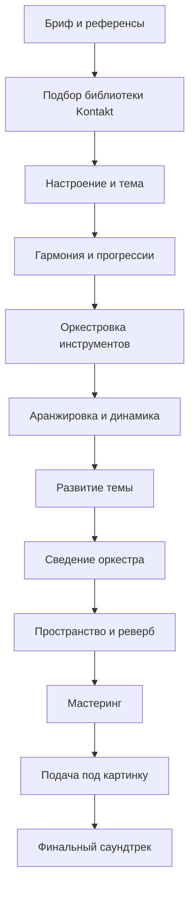

<h1>Этап №8</h1>

Кино- и игровой саунд-дизайн — создание оркестровых и атмосферных треков для визуального контента.

<i data-lucide="book-open" class="icon"></i> Kontakt
<i data-lucide="music" class="icon"></i> Оркестровка
<i data-lucide="film" class="icon"></i> Саундтрек
<i data-lucide="cloud-fog" class="icon"></i> Эмбиент
<i data-lucide="settings" class="icon"></i> Видеоряд

# Этап №8 — Саундтреки и Эмбиент

Вы освоили битмейкинг, сведение, живые инструменты и вокал. Теперь пришло время **кино- и игрового саунд-дизайна** — создания оркестровых и атмосферных треков для визуального контента.

В этом этапе мы разберём работу с оркестровыми библиотеками, написание кинематографичных тем, эмбиент-продакшн и сведение саундтреков.

## Что в этом этапе

### <i data-lucide="book-open" class="heading-icon"></i> Библиотеки Kontakt
1. **Настройка Kontakt** — загрузка, пресеты, управление памятью, NNTP
2. **Разница библиотек** — KMI, LSI, Spitfire, Orchestral Tools: что выбрать
3. **Какие выбрать** — бюджетные vs профессиональные сборки

### <i data-lucide="music" class="heading-icon"></i> Оркестровка и инструменты
4. **Струнные (Strings)** — секция, солисты, артикуляции, диапазоны
5. **Духовые (Winds)** — флейты, гобое, кларнеты, фаготы
6. **Пиано и Арфа** — роль в оркестре, текстуры
7. **Перкуссия** — тарелки, барабаны, тимпаны, ударные эффекты
8. **Синтезаторы и Сэмплы** — гибридный звук, текстуры, пэды

### <i data-lucide="pen-line" class="heading-icon"></i> Написание с нуля
9. **С чего начать** — настроение, референсы, подбор инструментов
10. **Гармония** — прогрессии аккордов, лады, развитие, разделение мелодий и аккордов
11. **Аранжировка** — размер, ритм, группы инструментов, динамика, артикуляция, напряжение

### <i data-lucide="film" class="heading-icon"></i> Стандартный оркестровый трек
12. **Саундтрек** — создание основной темы, развитие в инструментах
13. **Трейлер** — эпик, яркие темы, драмка, SFX

### <i data-lucide="pencil-ruler" class="heading-icon"></i> Оркестровая тема
14. **Звукоряд** — тональность, лад, тип движения, интервалы
15. **Оркестровые аккорды** — структура, расположение, обращения, голосоведение, задержания
16. **Оркестровый ритм** — остинато, акцентировка, пульсация

### <i data-lucide="image" class="heading-icon"></i> Саундтрек под картинку
17. **Настроение** — референсы под концепт, арты
18. **Подбор инструментов и разработка темы**

### <i data-lucide="clapperboard" class="heading-icon"></i> Музыка для фильма
19. **Функциональная музыка** — тема, не тянущая внимание на себя
20. **Настроение и атмосфера** — подбор под видео, смена аккордов и тональности
21. **Аранжировка** — основная тема, нарастание, эмбиент и текстуры

### <i data-lucide="headphones" class="heading-icon"></i> Сведение и Мастер
22. **Важность сведения** — компрессия, склеивание, громкость
23. **Пространство** — оркестровые референсы, зал, синты

### <i data-lucide="cloud-fog" class="heading-icon"></i> Эмбиент треки
24. **Атмосферные синты** — пэды, текстуры, мягкое наслоение
25. **Прогрессия и мелодика** — аккорды, сведение эмбиента

### <i data-lucide="settings" class="heading-icon"></i> Работа с видеорядом
26. **Кино, игры, анимация, трейлеры** — подходы и саунд-дизайн
27. **Техническая часть** — плагины, материалы, технический пайплайн

!!! important
    **Этот этап — переход от продюсера к композитору.** Саундтрек — это не просто музыка, это история, рассказанная звуком. Каждая глава отрабатывается на реальных проектах.

## Workflow саундтрека

---

  <input type="checkbox" class="potok-lesson" data-lesson="etap8-done">
  <label class="potok-lesson-label">✅ Этап №8 пройден</label>

**← [Назад: Этап №7 →](../etap7/fl-ableton-vokal.md)** | **[Далее: Библиотеки Kontakt →](kontakt-biblioteki.md)**
