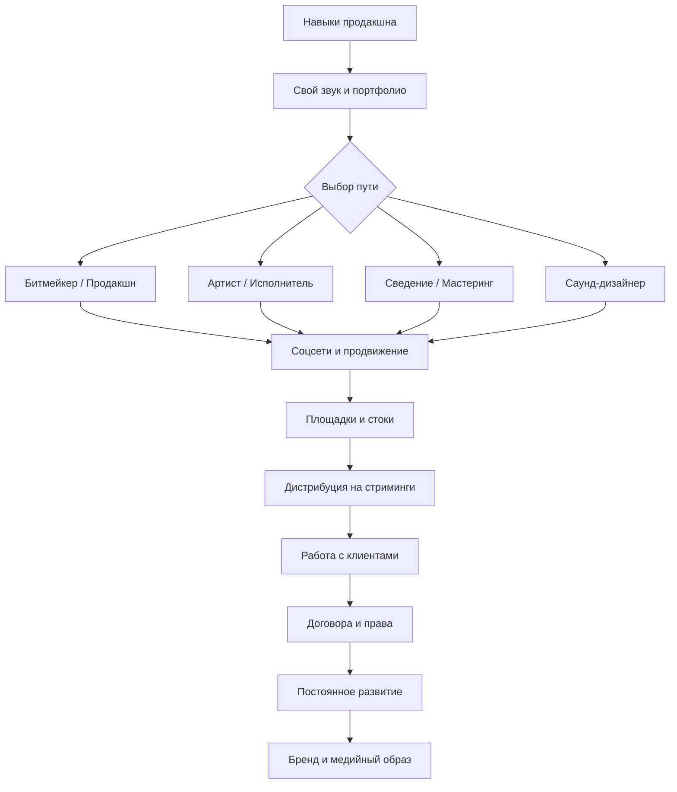

# Этап №9 — Продвижение и Способы заработка

Вы освоили битмейкинг, сведение, работу с вокалом, живыми инструментами и саунд-дизайн. Теперь пришло время **превратить навыки в карьеру** — научиться продвигать себя, монетизировать творчество и выстраивать профессиональные отношения.

В этом этапе мы разберём не только техническую сторону продвижения, но и **психологию творчества**, **коммерческие взаимоотношения**, а также то, как не выгореть на пути к своим целям.

## Что в этом этапе

### <i data-lucide="target" class="heading-icon"></i> Зачем продвигаться
1. **Цель пиара и музыки** — коммерция, развитие творчества, баланс

### <i data-lucide="share-2" class="heading-icon"></i> Социальные сети
2. **Социальные сети** — VK, TikTok, YouTube, Telegram, SoundCloud, создание и ведение аккаунтов

### <i data-lucide="dollar-sign" class="heading-icon"></i> Продажа битов и сведения
3. **Продажа битов и сведения** — анализ успешных, свой звук, площадки, работа со сведущими, студия

### <i data-lucide="database" class="heading-icon"></i> Стоки
4. **Стоки** — BeatStars, Pond5, AudioJungle, пассивный доход

### <i data-lucide="trending-up" class="heading-icon"></i> Прогресс в продвижении
5. **Прогресс в продвижении** — разбор успеха, тестирование сфер, медийный образ, связи, контент

### <i data-lucide="radio" class="heading-icon"></i> Выкладывание трека на площадки
6. **Выкладывание трека** — дистрибуция, стриминги, технические требования

### <i data-lucide="brain" class="heading-icon"></i> Креативное выгорание
7. **Как не перегореть** — вдохновение, цели, психология, примеры музыкантов

### <i data-lucide="clock" class="heading-icon"></i> Монетизация
8. **Когда начать монетизировать** — скилл, кайф от звука, опыт

### <i data-lucide="users" class="heading-icon"></i> Отношения с артистами
9. **Отношения с артистами** — общение, позиционирование, коллабы

### <i data-lucide="file-text" class="heading-icon"></i> Юридическая сторона
10. **Договора** — авторское право, роялти, интеллектуальная собственность, примеры

### <i data-lucide="circle-check" class="heading-icon"></i> Финал этапа
11. **Финал этапа** — чек-лист и следующий шаг

!!! important
    **Этот этап — переход от продюсера за компьютером к профессионалу индустрии.** Музыка — это не только креатив, но и бизнес, психология, нетворкинг. Каждая глава содержит примеры успешных артистов и разборы реальных кейсов.

## Путь продюсера

---

**← [Назад: Этап №8 →](../etap8/rabota-s-video.md)** | **[Далее: Цель пиара и музыки →](cel-prodvizheniya.md)**