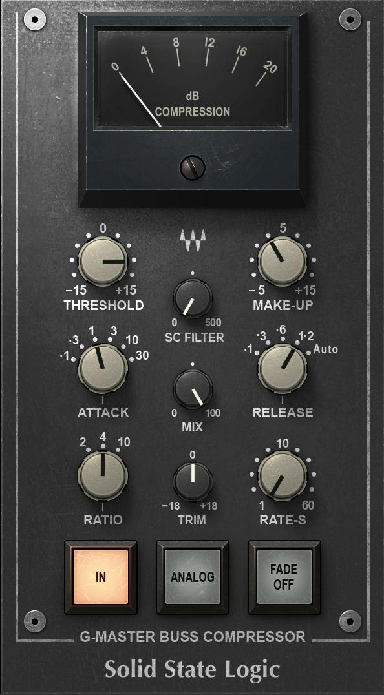
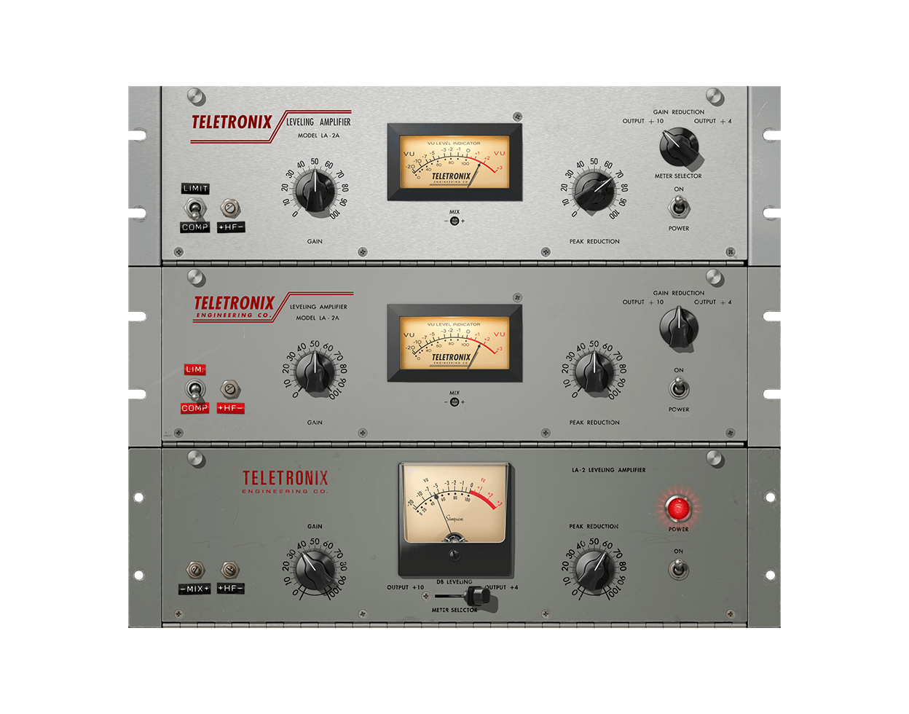
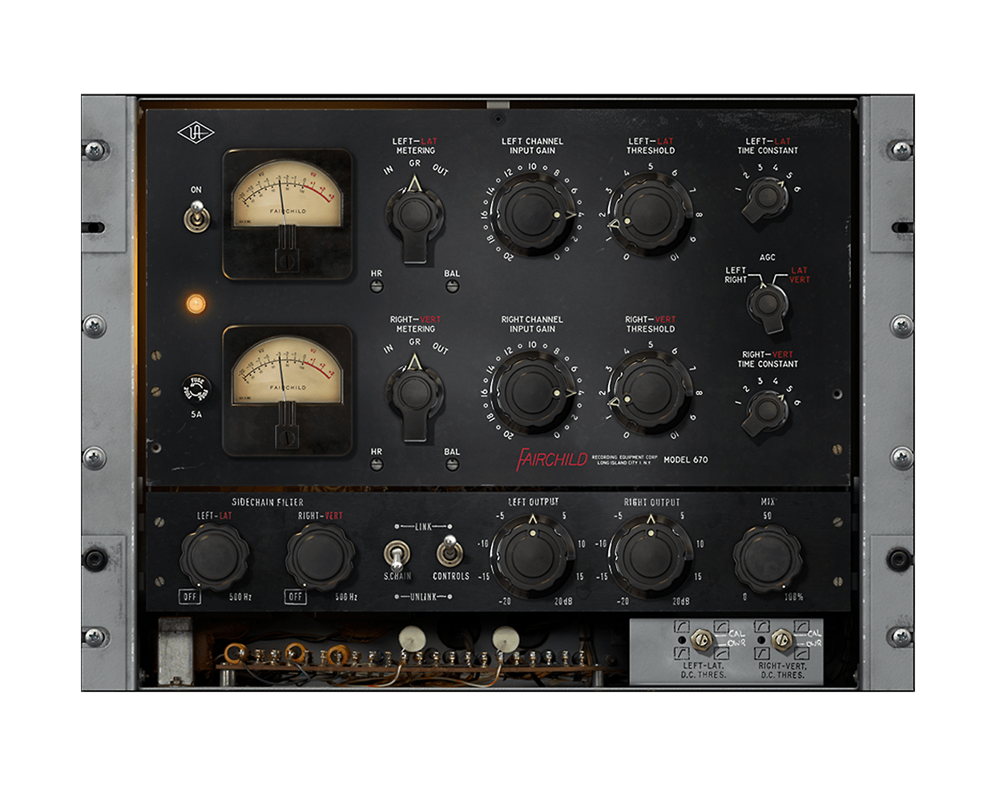
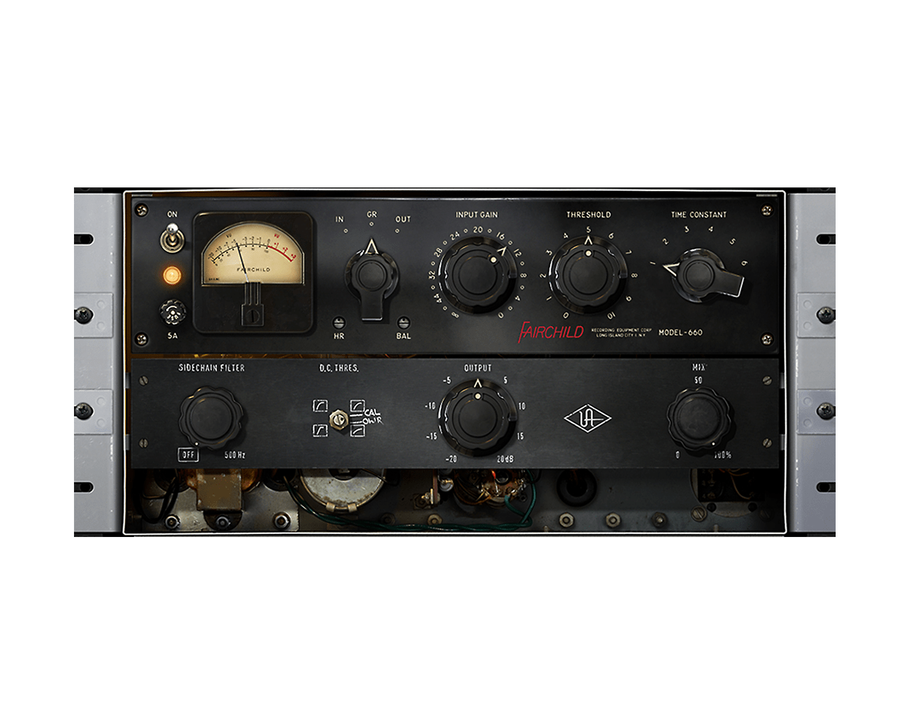

# Разновидности компрессоров

> *Часть потока по созданию музыки*

Компрессоры делятся не только по брендам — у каждого типа свой механизм работы, скорость и характер. В этой статье разбираем четыре легендарные разновидности: **glue-компрессор**, **LA-2A** (оптический), **1176** (FET) и **Fairchild 670** (ламповый). Плюс — параллельная компрессия и разбор атаки/релиза.

## Glue-компрессор («клей»)

«Glue» — это не отдельный механизм, а роль: шинный компрессор, который «склеивает» группу дорожек в единое целое. Когда через него прогнать барабаны или весь стереомикс, элементы перестают звучать разрозненно — микс становится плотнее и цельнее, будто его склеили.

Классика жанра — мастер-шина консоли **SSL 4000 G** (VCA-компрессор). Именно он дал термину имя: инженеры буквально говорили «glue the mix».

- **Что это:** Эмуляция мастер-шинного компрессора SSL 4000 G. VCA-механика — быстрая и прозрачная, без «окраски».
    
- **Особенности:** Не давит звук, а связывает его. Добавляет плотность и «аналоговость» без потери деталей.
    
- **Где использовать:** Шина барабанов (весь набор сразу), группа вокалов, мастер-шина.
    
- **Настройка:** Ratio 1.5–2:1, подавление 1–3 дБ — не больше. Атака/релиз по центру или в авто-режиме. Если микс «провалился» — ты пережал, убери gain reduction.
    
- **VST:** Waves SSL G-Master Buss Compressor (входит в SSL Collection).
    

## LA-2A — оптический компрессор

- **Что это:** Эмуляция *Teletronix LA-2A Leveling Amplifier* (1960-е). Самый известный вокальный компрессор в истории — на нём сведены тысячи хитов.
    
- **Механизм:** Оптический — сигнал светит на фотоэлемент, который управляет усилением. Свет не может реагировать мгновенно, поэтому LA-2A по природе медленный и плавный.
    
- **Особенности:** В нём нет регуляторов атаки и релиза — только входной гейн и индикатор Peak Reduction. Звучит мягко, «музыкально», незаметно сглаживает динамику без потери характера.
    
- **Где использовать:** Вокал (особенно лиричный), бас-гитара, соло-инструменты, мастеринг-шина.
    
- **Настройка:** Поднимай входной гейн, пока на индикаторе Peak Reduction не появится нужное подавление — обычно 3–6 дБ. Всё. Больше крутить нечего.
    
- **VST:** UAD Teletronix LA-2A Leveler Collection (три ревизии), Waves CLA-2A → [Waves CLA](waves-cla.md).
    

## 1176 — FET-компрессор

- **Что это:** Эмуляция *UREI/UA 1176LN Limiting Amplifier* (1968). Фирменный «панч» рок- и поп-записей.
    
- **Механизм:** FET — полевой транзистор. Самый быстрый компрессор среди классики: реагирует за доли миллисекунды.
    
- **Особенности:** Агрессивный, плотный, «нервный». Соотношения выбираются кнопками 4:1–20:1. Фирменная фишка — режим **All Button** (все кнопки нажаты сразу): компрессор работает во всех соотношениях одновременно и даёт дикое насыщение с искажениями.
    
- **Где использовать:** Барабаны (бочка, снейр), агрессивный вокал, бас, гитары — везде, где нужен удар и плотность.
    
- **Настройка:** Для ударных — атаку на самую быструю позицию (1–3), релиз быстрый, ratio 4:1–8:1 для контроля, All Button — когда хочешь «раздавить» снейр до текстуры.
    
- **VST:** UAD 1176 Classic Limiter Collection (Rev A / Rev E / AE), бесплатный UA 1176 FET, Waves CLA-76 → [Waves CLA](waves-cla.md).
    

## Fairchild 670 — ламповый компрессор

- **Что это:** Эмуляция *Fairchild CMA 381* (серии 660/670, 1950–60-е). Компрессор с самым «дорогим» звуком в истории — на нём сведены записи The Beatles, Beach Boys и десятки других классических альбомов.
    
- **Механизм:** Ламповый каскад усиления + уникальная схема: gain reduction управляется не пиками сигнала, а средним уровнем с VU-метра. То есть компрессор реагирует на «воспринимаемую громкость» — поэтому он так плавно и естественно обволакивает звук.
    
- **Особенности:** Средний/медленный темп, тёплый ламповый характер, добавляет веса и масштаба. Не для агрессивного давления — это инструмент «большого звука».
    
- **Где использовать:** Мастеринг (классика жанра), шина барабанов, вокал, бас — везде, где миксу не хватает масштаба и склейки.
    
- **Настройка:** Ratio 2:1–4:1 для склейки, до 8:1 — когда нужен лимитер. Атака/релиз обычно по центру. Подавление 2–6 дБ на шинах, 1–3 дБ на мастере.
    
- **VST:** UAD Fairchild Tube Limiter Collection (660 + 670), Overloud GEM COMP670 → [Meraki Collection](meraki-collection.md).
    

## Параллельная компрессия

Обычная компрессия давит динамику напрямую — и вместе с пиками может унести панч. **Параллельная компрессия** решает это иначе: оригинальный трек остаётся нетронутым, а рядом работает его сильно сжатая копия.

Как настроить:

1. Дублируй дорожку (например, бочку или всю группу барабанов).
    
2. На копии вешаешь компрессор и жмёшь сильно: ratio 8:1–20:1, быстрая атака и релиз, gain reduction 6–12 дБ. Сжатая копия должна звучать «плоско» и тяжело — это нормально.
    
3. Приглушаешь сжатую дорожку и подмешиваешь её к оригиналу, пока не почувствуешь прирост: панч и плотность добавились, а динамика осталась живой. Обычно хватает 20–50% уровня копии.
    
4. По желанию — EQ на параллельной шине: срежь низы (чтобы не было мутного наложения) или подними средние для «тела».

Где использовать: барабаны (классика жанра), бас, вокал, мастер-шина. С 1176 и Fairchild параллельная компрессия — основной способ работы: они дают характер, а сухой сигнал сохраняет атаку.

## Атака, релиз и остальные параметры

- **Threshold (порог):** Уровень, выше которого компрессор начинает работать. Ниже порога — сигнал проходит без изменений.
    
- **Ratio (соотношение):** Насколько сильно давится то, что выше порога. 2:1 — мягкий контроль, 4:1 — рабочий стандарт, 8:1 и выше — жёсткое лимитирование.
    
- **Attack (атака):** Скорость, с которой компрессор начинает подавлять сигнал после превышения порога. Быстрая атака срезает транзиенты — звук становится мягче и «круглее». Медленная атака пропускает транзиент — сохраняется панч и ударность. Для барабанов часто берут медленную атаку именно ради этого.
    
- **Release (релиз):** Скорость, с которой компрессор отпускает сигнал после спада ниже порога. Слишком быстрый релиз даёт «дыхание»/помпинг — громкость пульсирует в такт. Слишком медленный — компрессор не успевает отпустить и смазывает динамику следующих нот.
    
- **Knee (колено):** Мягкий переход к сжатию (soft knee) звучит естественнее, резкий (hard knee) — более контролируемо и жёстко.
    
- **Makeup gain:** Компенсация громкости после сжатия. Компрессор уменьшает пиковый уровень, makeup возвращает громкость — но теперь без пиков, то есть «плотнее».
    

Правило: начинай со средних значений атаки/релиза и крути на слух. Быстрее/медленнее — это не «лучше/хуже», а другой характер звука.

## Сводная таблица

| Компрессор | Тип механизма | Скорость | Характер | Где использовать |
|------------|---------------|----------|----------|------------------|
| **SSL G-Master (glue)** | VCA | Средняя | Прозрачный «клей», склеивает микс | Шина барабанов, группа вокалов, мастер |
| **LA-2A** | Оптический | Медленная | Мягкий, музыкальный, незаметный | Вокал, бас, соло-инструменты, мастеринг |
| **1176** | FET | Очень быстрая | Агрессивный панч и плотность | Барабаны, вокал, бас, гитары |
| **Fairchild 670** | Ламповый (VU) | Средняя/медленная | Тёплый «дорогой» масштаб | Мастеринг, шина барабанов, вокал, бас |

!!! tip
    Не нужно владеть всеми четырьмя. Для старта достаточно одного быстрого (1176-типа) и одного медленного (LA-2A-типа) — на них закрывается 90% задач. Glue и Fairchild добавляй, когда начнёшь работать с шинами и мастером.

---

[Теория компрессии →](../etap2/compression-kompressiya.md) · [Все плагины →](index.md) · [На главную →](../index.md)
