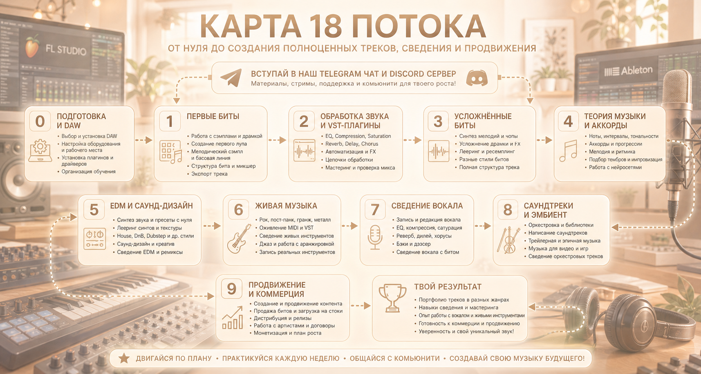

# Маршрут обучения — Поток 18

Пошаговый план на **11 недель** для перехода от нуля к созданию
полноценных треков, сведению и продвижению.

> **Важно!** Для максимального результата обязательно вступайте в наш
> Telegram-чат и Discord-сервер. Там вы будете в курсе всех событий,
> получите доступ к материалам и стримам, а также сможете поддерживать
> контакт с другими участниками потока — это значительно ускоряет
> обучение и помогает не потерять мотивацию.

## Неделя 0: Подготовка работы и DAW

| Тема | Разделы | Задание |
|------|---------|---------|
| Выбор DAW | FL Studio 25, Ableton Live 12, другие DAW | Установить DAW, освоить интерфейс |
| Какую DAW выбрать | Первый взгляд, визуал, логика работы, удобство | Определиться с DAW |
| Оборудование | WIN/MAC, наушники, мониторы, микрофон, MIDI-клавиатура, аудиокарта | Составить список необходимого |
| Рабочее место | Комната, стол, расстановка мониторов | Настроить рабочее место |
| Аудио драйверы | ASIO, внешняя звуковая карта | Подключить ASIO-драйвер |
| Установка программ и VST | Последовательная установка, сэмпл-паки | Установить базовый набор плагинов |
| Оптимизация компа | ЦП, задержка звука (буфер) | Настроить буфер и latency |
| Программы для заметок | Xmind, Obsidian, тетрадка | Выбрать инструмент для заметок |
| Организационные вопросы | Чаты, стримы, домашки, материалы, эвенты | Вступить в чат, ознакомиться с расписанием |

## Неделя 1: Первые Биты

| Тема | Разделы | Задание |
|------|---------|---------|
| Что такое сэмпл | Ударка, мелодический сэмпл, сэмпл-паки | Изучить первые сэмпл-паки |
| Драмка | Kick, Snare, Clap, Hat; частотные диапазоны | Написать первый драм-паттерн |
| Channel Rack (FL Studio) | Расстановка ударки, темп, сетка, MIDI-паттерн, луп | Создать луп драмки |
| Подбор сэмплов | Один пак, жанр, наслуха, баланс громкости | Подобрать совместимую драмку |
| Структура бита | Пирамида, лестница | Определить структуру |
| Микшер | Громкость, расположение дорожек | Настроить микшер |
| Мелодия в бите | Поиск сэмпла, BPM, стретч/warp, подбор к биту | Вставить мелодический сэмпл |
| Бас | 808, риз-бас, тональность, пиано-ролл, корневая нота | Написать басовую линию |
| Мастер канал | Сумма звуков, главный принцип | Проверить мастер |
| Рендер | Громкость, зона рендера, качество, FL/Ableton | Экспортировать трек в MP3 |

## Неделя 2: Обработка звука и VST-плагины

| Тема | Разделы | Задание |
|------|---------|---------|
| Основные понятия | Сведение, широкий/яркий/глухой/атмосферный звук | Пройти теорию |
| EQ / Эквализация | Срез частот, добавление частот, динамическая EQ | Научиться использовать EQ |
| Saturation | Гармоники, уплотнение, острота, дисторшн | Применить сатурацию к биту |
| Reverb | Пространство, сенды, глубина, ошибки размытости | Добавить реверб через Return |
| Delay | Повтор, фидбэк, пинг-понг, применение | Настроить делэй |
| Chorus | Водянистый звук, наслонение, винтаж | Экспериментировать с хорусом |
| Compression | Уравнивание громкости, применение, мультiband | Скомпрессировать дорожки |
| Limiter и Clipper | Потолок, усреднение, KClip3, Standard Clip | Поставить лимитер на мастер |
| Стилизация сэмплов | Ретро, текстуры, ShaperBox 3, BEAM, PORTAL | Обработать сэмпл FX-плагинами |
| Автоматизация | Основные фишки, структура трека | Автоматизировать параметры плагинов |
| Последовательность обработки | Порядок плагинов, сенды, параллельная обработка | Выстроить цепочку эффектов |
| Мастер канал | Tonal Balance, LUFS, Speccraft, Soothe2, референсы | Проверить мастер перед рендером |
| Слух | Частоты, отдых, тренировка, психоакустика | Пройти тренировку слуха на Webtet |

## Неделя 3: Усложнённые биты

| Тема | Разделы | Задание |
|------|---------|---------|
| Мелодии и синтезаторы | Тональность, ритмика, VST-синты, ADSR, one-shot | Написать первую мелодию на синтезаторе |
| Chop-мелодии | Ритмика, Fruity Slicer, Ableton | Нарезать мелодию на чопы |
| Усложнение драм-партии | Прописание, перкуссия, креши, Foley, групповая обработка | Добавить перкуссию и FX в драмку |
| Лееринг и ресемплинг | Уплотнение, уникальность, Splice | Научиться леерить сэмплы |
| BoomBap-биты | Сэмплирование, винтаж, грув, триоли | Создать BoomBap-бит |
| Rock Beats / NFS | Альтернатива 2000-х, лайв-драмка, гитары, дисторшн | Сделать рок-бит |
| Жёсткие биты (Bass Boosted) | Драмка, лид-синт, RIFT, грязный звук | Написать бас-буст трек |
| Обработки FX | ShaperBox 3, EFX Motions, BEAM, PORTAL, реверс, фильтр | Применить FX-манипуляции |
| Структура трека | Куплет, припев, интро, бридж, анализ треков | Построить полную структуру |
| Мастер | Tonal Balance, Ozone 12, клипперы | Освоить мастеринг |
| Разбор референсов | Стрим-разбор битов | Разобрать 2–3 трека-референса |

## Неделя 4: Теория музыки и аккорды

| Тема | Разделы | Задание |
|------|---------|---------|
| Музыка как язык | Гармония, фразы, музыкальный опыт | Понять основы музыкального языка |
| Ноты | 7 нот, диезы/бемоли, тон/полутон, пианино | Выучить расположение нот на пиано-ролле |
| Интервалы | Минорная/мажорная терция, квинта, октава | Определить интервалы на слух |
| Тональность | Scale, мажор, минор, лады, устойчивые ступени | Определить тональность сэмпла |
| Аккорды | Логика построения, 3+ нот, бас, гармонический пол | Создать 5 аккордовых прогрессий |
| Сочетания аккордов | I-vi-iii-V, i-iii-vi, i-iii-iv-v, 7/9 ступени | Написать красивые переходы |
| Мелодия к аккордам | Арпеджио, вопрос-ответ, мотив | Написать мелодию поверх аккордов |
| Ритмика | Ритм мелодии, кач, паузы, ошибки | Добавить ритмическое разнообразие |
| Тембры | Яркость, стилевое сочетание, читаемость | Подобрать тембры для жанра |
| Импровизации | Мелодии, тренировка аккордов, MIDI-паттерны | Записать импровизацию |
| Нейросети для музыки | Аккорды, советы, генерация идей | Попробовать AI-ассистента |

## Неделя 5-6: EDM и Саунд-дизайн

| Тема | Разделы | Задание |
|------|---------|---------|
| Синтез звука | Wavetable, синусоида, квадрат, треугольник | Понять основы синтеза |
| Serum / Vital / Phase Plant | Wavetable, ADSR, LFO, фильтры, пресеты | Создать первый пресет с нуля |
| Лееринг синтов | Атмосфера, текстура, уникальность | Научиться леерить синтезаторы |
| House | Прямая бочка, сайдчейн, ambient house | Написать House-трек |
| DnB | 174 BPM, риз-бас, neurofunk | Создать DnB-бит |
| Dubstep | 140 BPM, дроп, структура | Написать Dubstep-трек с дропом |
| Crystal Castles | Синты, крипота, риз-бас, андерграунд | Повторить стиль Crystal Castles |
| 2hollis / EDM-биты | Драмка, арпеджиаторы, жирный бас, клиппинг | Сделать EDM-бит с перегрузом |
| DeathStep / Fatal-M | Криповый звук, дисторшн, атмосфера | Написать DeathStep-трек |
| Саунд-дизайн / Acropool | Философия, теория, синтез, сэмплинг | Изучить подходы к саунд-дизайну |
| Сведение EDM | OTT, сайдчейн, лимитер, Ear Candy | Освоить сведение EDM |
| Ремиксы* | Акапеллы, темп, тональность, хаус-версии | Заремиксить один трек |

## Неделя 7: Живая музыка

| Тема | Разделы | Задание |
|------|---------|---------|
| Рок | Гитара, бас, драмка, альтернатива, shoegaze | Написать рок-трек с VST |
| Оживление VST | Велосити, мимо сетки, удачная библиотека | Добавить живости в MIDI |
| Сведение рока | Гитары, драмка, бас, мастер | Свести рок-трек |
| Пост-панк | Гитары, электроника, реверб, атмосфера | Создать пост-панк трек |
| Гранж | Гаражный звук, модуляция, энергетика | Написать гранж-трек |
| Метал | Shreddage, Perfect Drums, мощность, Nu-Metal | Написать метал-трек |
| Джаз | Клавиши, трубы, дабл-бас, ii-V-I, noir jazz | Создать джазовую композицию |
| Работа с реальными инструментами* | Микрофон, гитары, звуковуха, шум, запись | Записать живой инструмент |

## Неделя 8: Сведение вокала

| Тема | Разделы | Задание |
|------|---------|---------|
| Зачем сведение вокала | Тренировка слуха, биты с вокалом, анализ | Понять важность сведения |
| Запись вокала | Микрофон, установка, рабочий процесс | Записать тестовый вокал |
| Редакция вокала | Ритмика, нарезка, VocAlign, Melodyne, Auto-Tune, RX 11 | Отредактировать и тюнить вокал |
| EQ вокала | Срез, яркость, динамическая EQ | Эквалайзить вокал |
| Компрессия вокала | Threshold, Ratio, Attack/Release, Distressor, 1176, LA2A | Скомпрессировать вокал |
| Сатурация вокала | Плотность, кранч, дополнительная компрессия | Добавить сатурацию |
| Reverb и Delay | Return-сенды, комната, пинг-понг, фильтры | Настроить пространство вокала |
| Chorus / Даблер | Широкий звук, детюн, ритмика | Добавить ширину вокала |
| DeEsser | Сибилянты, динамика высоких | Убрать шипящие |
| Бэки | Яркость, панорама, делэй, реверб | Свести бэк-вокал |
| Сведение с битом | Свободное место, плотные биты, сенды, фишки | Свести вокал с инструменталом |
| Чек микса | Soothe2, MID/SIDE, LUFS, референс | Проверить финальный микс |
| Стрим-разбор | Стили, StemSeparator, ADPTR Meter | Разобрать треки-референсы |

## Неделя 9: Саундтреки и эмбиент

| Тема | Разделы | Задание |
|------|---------|---------|
| Библиотеки Kontakt | Настройка, выбор библиотек | Установить оркестровые библиотеки |
| Оркестровка | Струнные, духовые, пиано, арфа, перкуссия | Изучить диапазоны инструментов |
| Написание с нуля | Настроение, референсы, гармония, аранжировка | Написать оркестровую тему |
| Саундтрек | Основная тема, аккорды, развитие | Создать 1-минутный саундтрек |
| Трейлер | Эпик, драмка, SFX | Написать трейлер-музыку |
| Оркестровые аккорды | Трезвучие, септаккорд, обращения, голосоведение | Освоить оркестровые аккорды |
| Саундтрек под картинку | Настроение, арты, подбор инструментов | Написать музыку по референсу |
| Музыка для фильма | Функциональная музыка, атмосфера, нарастание | Создать саундтрек для видео |
| Сведение саундтрека | Компрессия, пространство, зал | Свести оркестровый трек |
| Дополнение от Acropool | Кино, игры, анимация, подходы | Изучить материалы по саунд-дизайну для медиа |

## Неделя 10: Продвижение и коммерция

| Тема | Разделы | Задание |
|------|---------|---------|
| Цель пиара | Коммерция, развитие творчества | Определить цели |
| Социальные сети | VK, TikTok, YouTube, SoundCloud, аккаунты | Создать профили |
| Продажа битов | Анализ, свой звук, площадки, студии | Зарегистрироваться на BeatStars |
| Стоки | BeatStars, Pond5, AudioJungle | Загрузить первые биты |
| Прогресс в продвижении | Контент, коллабы, медийный образ, связи | Начать вести контент |
| Выкладывание треков | Дистрибьюция, стриминги | Выпустить трек на площадки |
| Творческие проблемы | Вдохновение, цели, выгорание | Составить план творчества |
| Монетизация | Скилл, кайф от звука, опыт | Определить точку старта |
| Отношения с артистами | Общение, сроки, договорённости, коллабы | Научиться работать с клиентами |
| Договоры | Авторское право, роялти, ИС, примеры | Изучить типовые договоры |

## Прогресс-трекер

- [ ] Неделя 0: Подготовка и DAW
- [ ] Неделя 1: Первые биты
- [ ] Неделя 2: Обработка звука и VST
- [ ] Неделя 3: Усложнённые биты
- [ ] Неделя 4: Теория музыки и аккорды
- [ ] Неделя 5: EDM и саунд-дизайн
- [ ] Неделя 6: Живая музыка
- [ ] Неделя 7: Сведение вокала
- [ ] Неделя 8: Саундтреки и эмбиент
- [ ] Неделя 9: Продвижение и коммерция

!!! tip
    Не спешите. Лучше качественно пройти 6 недель, чем
    бегло прочитать всё за 2 дня. Практика — ключ к успеху.

---

[На главную →](index.md)
