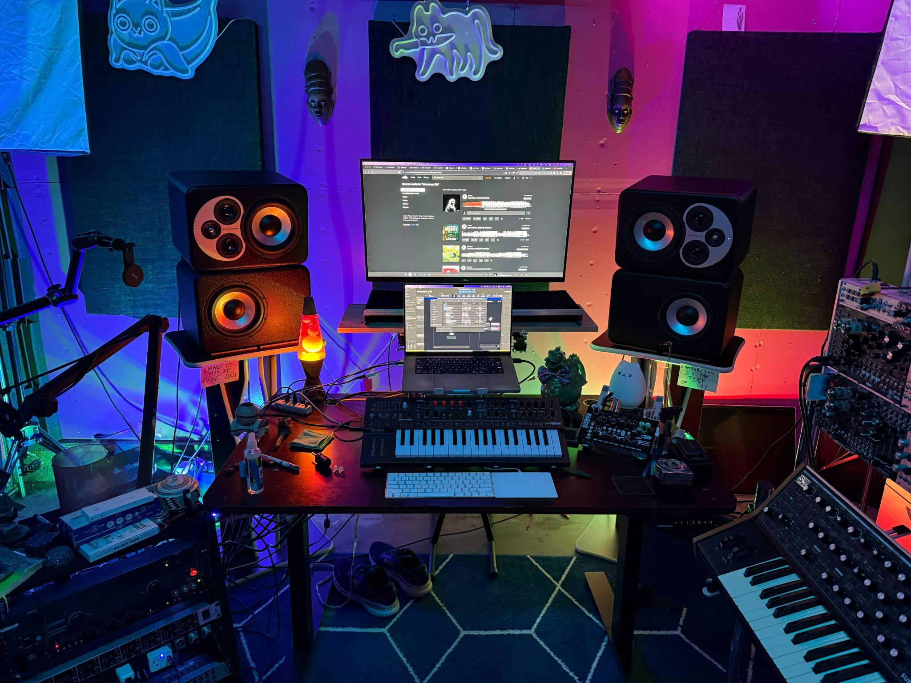
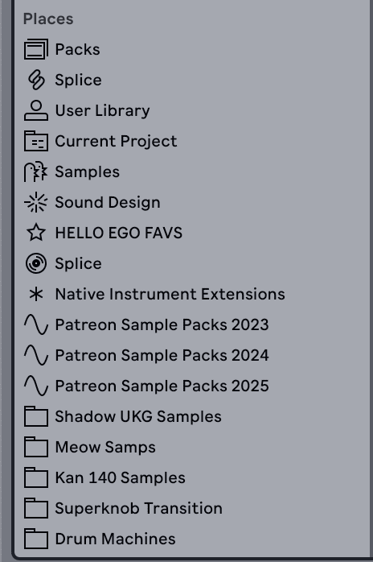
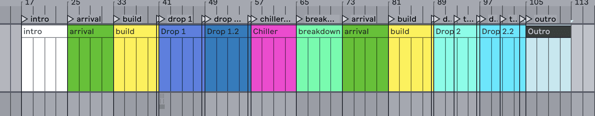
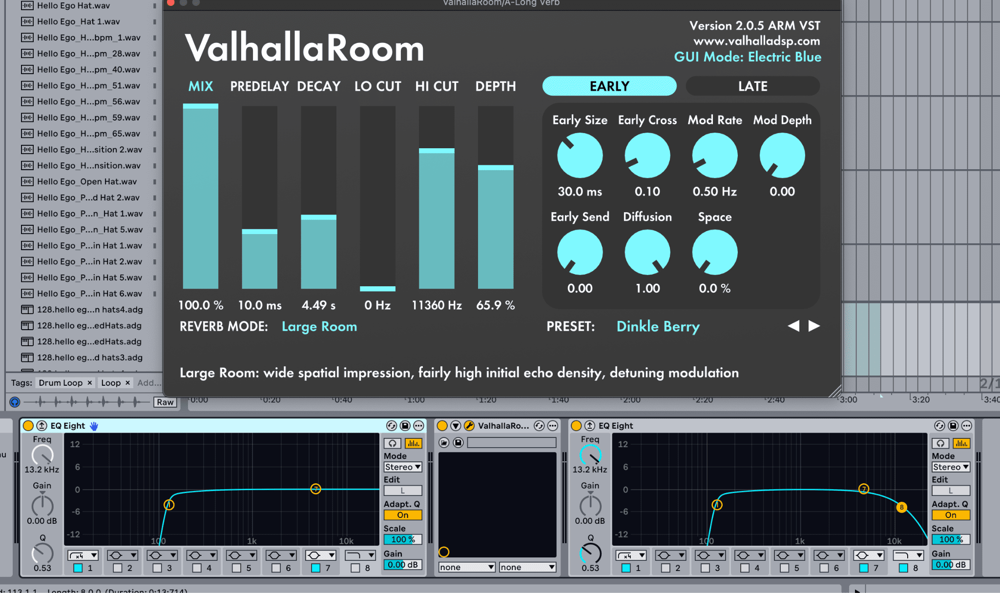
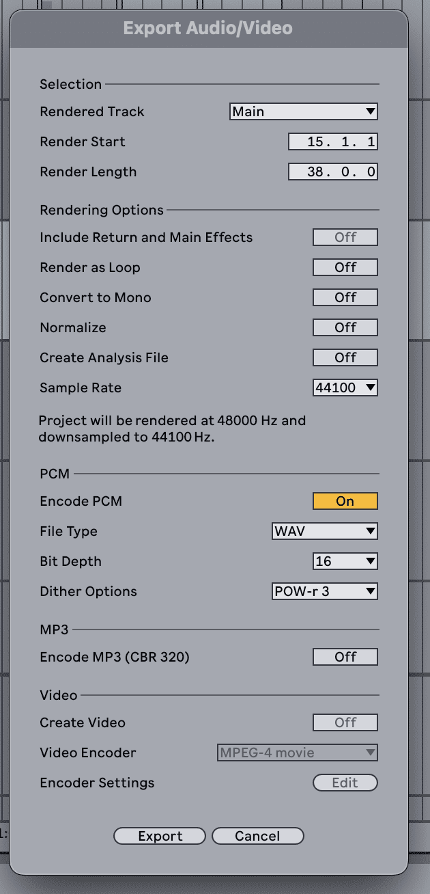
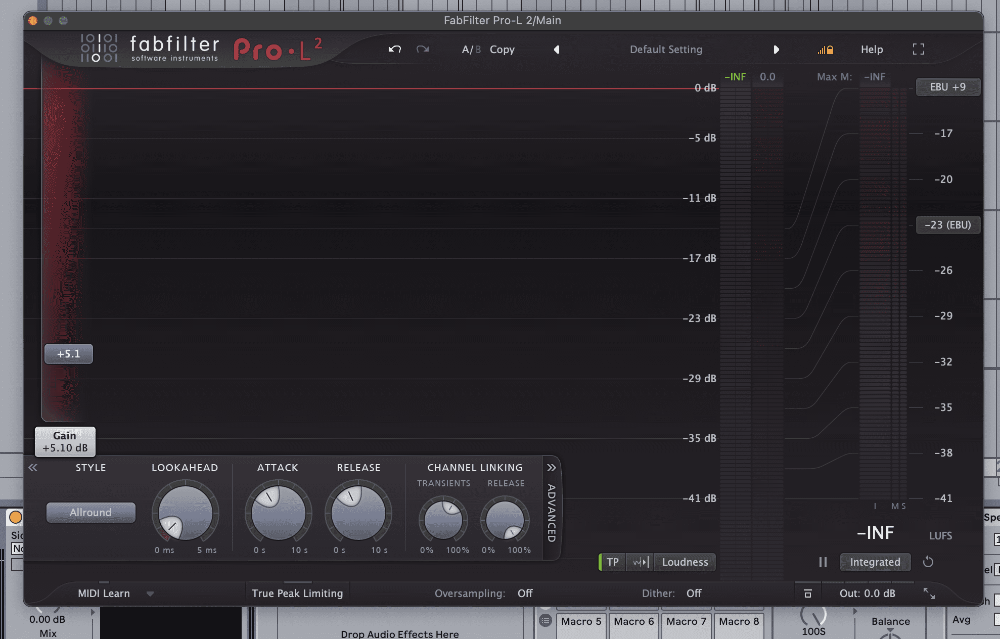

# <i data-lucide="lightbulb" class="page-icon"></i> СОВЕТЫ УЧЕНИКУ

Самые важные и интересные советы по продакшну — выжимка из топовых статей и практики. Это те вещи, которые реально отделяют любителя от профи, и они не зависят от DAW или жанра.

!!! tip
    **Главное правило:** бери 2–3 совета за сессию и реально применяй их в работе. Список, который просто прочитал, ничего не стоит — список, который применил, меняет твой workflow.

## <i data-lucide="zap" class="section-icon"></i> WORKFLOW И СКОРОСТЬ

### <i data-lucide="file-box" class="q-icon"></i> Шаблон проекта

Собери template с уже настроенными дорожками, любимыми плагинами и дефолтным BPM (File → Save as Template). Каждый новый трек начинается без «настройки под себя» — это экономит время на каждом треке. Пересобирай шаблон по мере того, как меняется твой workflow.

### <i data-lucide="palette" class="q-icon"></i> Цветовая кодировка дорожек

Свяжи цвет с функцией: синий — драм, зелёный — синты, красный — вокал. Проект становится читаемым за секунду, особенно когда дорожек 40+.

### <i data-lucide="keyboard" class="q-icon"></i> Горячие клавиши

Шорткаты окупаются в первую неделю. Начни с 10 самых частых действий: mute/solo, zoom, nudge, копирование клипа. Руки перестанут бегать к мыши — и руки останутся на игре/настройке.

### <i data-lucide="folder-tree" class="q-icon"></i> Организация сэмплов + нейминг

Когда вдохновение пришло, нужный звук должен находиться за секунды. Заведи понятную структуру папок и называй файлы по схеме: `Kick_808_140BPM_Cmin`. Выбрасывай мусор — низкое качество в библиотеке только замедляет.

### <i data-lucide="save" class="q-icon"></i> Версии проекта и демо-рендеры

Сохраняй проект версиями (v1, v2, v3) по ходу работы и выводи демо MP3 после каждой сессии. Это страховка от крашей, «потерянных» идей и вечного сравнения «а было лучше раньше». Подробнее про рендер — в [Рендер трека](etap1/render-traka.md).

### <i data-lucide="hard-drive" class="q-icon"></i> Бэкап проектов

Краш или мёртвый диск стирают недели работы. Копируй проекты и сэмплы на внешний диск или в облако — регулярно, а не «когда-нибудь».

## <i data-lucide="bar-chart-3" class="section-icon"></i> РЕФЕРЕНСЫ

### <i data-lucide="target" class="q-icon"></i> Референс всегда включён

Держи профессионально сведённый трек в своём жанре открытым во время сведения. Так ты понимаешь, что «правильно» по громкости, балансу и ощущению — без самообмана.

### <i data-lucide="scale" class="q-icon"></i> Сравнивай при равной громкости

Приведи референс к уровню своего микса (ориентир: ~−14 LUFS для стриминга) перед сравнением. Иначе ты гонишься за громкостью, а не за качеством — и будешь постоянно «недо-» или «пере-» давить.

### <i data-lucide="ruler" class="q-icon"></i> Референс — это не только звук

Бери с референса структуру (где дроп/бридж), темп, плотность аранжировки и общее ощущение. Полная статья по теме: [Работа с референсами](etap2/references.md).

## <i data-lucide="flag" class="section-icon"></i> КАК ДОДЕЛАТЬ ТРЕК

### <i data-lucide="brain-circuit" class="q-icon"></i> Не углубляйся в EQ/компрессию на этапе написания

Самая частая ошибка: час полировать эквалайзер одного сэмпла, пока трек — это 8 тактов. Сначала добей аранжировку и структуру, потом звук. Сводить плохую песню — выброшенное время.

### <i data-lucide="volume-x" class="q-icon"></i> Аранжировка через mute

Играй полный луп и в реальном времени мутя дорожки собирай структуру: где что входит, где тишина, где дроп. Это быстрее, чем рисовать клипы по одному, и ты слышишь трек целиком.

### <i data-lucide="disc-2" class="q-icon"></i> Рендер MIDI в аудио — чтобы «закрыть» композицию

Когда аранжировка готова, рендери MIDI-дорожки в аудио. Это останавливает бесконечное переделывание нот и заставляет двигаться дальше. Про consolidate: [Рендер и Consolidate](etap3/render-consolidate.md).

### <i data-lucide="ear" class="q-icon"></i> Доверяй ушам, а не глазам

Записывай в блокнот то, что слышишь («бас гулит», «хэт тупит»), выключай экран и слушай трек как обычный человек. Свежие уши ловят проблемы, которые уставшие пропускают.

### <i data-lucide="trophy" class="q-icon"></i> Один доделанный плохой трек > идеальный луп

Один законченный трек с шероховатостями учит больше, чем месяц полировки одного 8-тактового лупа. Finishing is a skill — и она прокачивается только финишем.

## <i data-lucide="sparkles" class="section-icon"></i> ЗВУК: ПОДБОР И ДИЗАЙН

### <i data-lucide="gem" class="q-icon"></i> Подбор звуков решает всё

Sound selection — то, что делает микс профессиональным или нет. Потрать реальное время на выбор сэмплов и синтов, которые дополняют друг друга и подходят стилю трека. Один хороший сэмпл важнее десяти обработок.

### <i data-lucide="layers" class="q-icon"></i> Лейеринг для глубины

Складывай звуки слоями: два кика, сэт + перкусшн, пэд + арпеджио. Слой даёт глубину и текстуру — но следи, чтобы слои не спорили по частотам (EQ-режь лишнее).

### <i data-lucide="sliders-horizontal" class="q-icon"></i> Пресеты — это стартовая точка

Пресет хорош как запуск, но подкрути cutoff, attack, release, пока звук не станет «твоим». Открывай чужие патчи и разбирай, что в них настроено — так быстрее всего учатся.

### <i data-lucide="hand" class="q-icon"></i> Humanize MIDI + swing

Стерильные MIDI-паттерны звучат запрограммированными. Добавь лёгкий swing, разбей velocity, сдвинь ноты на миллисекунды — и паттерн начинает «играть».

### <i data-lucide="filter" class="q-icon"></i> High-pass на реверб-сёндах

Режь низ на всех reverb/delay-сёндах (обычно от 200–300 Hz). Мгновенно убирает грязь в низах, не трогая сам звук.

## <i data-lucide="mixer-vertical" class="section-icon"></i> БАЗА СВЕДЕНИЯ

### <i data-lucide="scissors" class="q-icon"></i> High-pass всё, кроме баса и кика

Режь низы (от 80–100 Hz) на всех дорожках, которые не должны жить в низах. Низ становится чище и сфокусированнее сразу — это первый шаг любого микса.

### <i data-lucide="volume-2" class="q-icon"></i> Своди при умеренной громкости

Миксуй на среднем уровне (~75–80 dB SPL) и периодически проверяй микс тихо: тихий мониторинг обостряет решения по балансу и бережёт уши от усталости.

### <i data-lucide="square" class="q-icon"></i> Проверяй в моно

Переключайся в mono регулярно: фазовые проблемы прячутся в стерео и вылезают мгновенно в моно. Если микс «тонет» в mono — у тебя конфликт дублирующихся звуков.

### <i data-lucide="gauge" class="q-icon"></i> Параллельная компрессия для панча

Сожми копию дорожки жёстко (например, ratio 10:1) и смешай с оригиналом — получаешь панч и плотность без «задавливания» динамики. Работает на драмах, басах и даже на микс-бусе.

### <i data-lucide="coffee" class="q-icon"></i> Перерывы + чужое мнение

Усталость убивает объективность: делай перерывы между сессиями и показывай микс тем, кому доверяешь. Они услышат то, на что ты ослеп.

## <i data-lucide="disc-3" class="section-icon"></i> МАСТЕРИНГ И ЭКСПОРТ

### <i data-lucide="trending-down" class="q-icon"></i> Оставь headroom перед мастерингом

Держи пики около −6 dBFS, чтобы у мастера (или твоего лимитера) было пространство. Не дави микс в ноль — это забирает динамику и оставляет мастеру только мусор.

### <i data-lucide="radio" class="q-icon"></i> Цель по громкости: ~−14 LUFS

Для стриминга ориентируйся на −14 LUFS integrated (клубные треки могут быть громче). Измеряй луднес-метром, а не «на глаз». Подробнее: [Мастеринг](etap2/mastering.md).

### <i data-lucide="car" class="q-icon"></i> Тестируй на разных системах

Проигрывай финал в наушниках, в машине и на дешёвых колонках. Трек должен держать форму везде — если он хорош только на твоих мониторах, он ещё не готов.

## <i data-lucide="cpu" class="section-icon"></i> ИЗУЧИ СВОЮ DAW ГЛУБЖЕ

### <i data-lucide="percent" class="q-icon"></i> Ты используешь ~10% софта

Средний продакшер трогает процентов десять того, что умеет его DAW — а потом покупает плагины, чтобы закрыть «дыры», которых не существовало. Изучи стоковые плагины, роутинг и шорткаты своей DAW до покупки нового софта.

### <i data-lucide="mouse-pointer-click" class="q-icon"></i> Свои пресеты и макросы

Собирай собственные пресеты в плагинах, которыми пользуешься чаще всего, и маппь частые цепочки на макросы/MIDI-контроллер. Через месяц твой workflow станет заметно быстрее — без единого нового плагина.

## <i data-lucide="flame" class="section-icon"></i> ПРИВЫЧКИ, КОТОРЫЕ ДЕЛАЮТ ЛУЧШЕ

### <i data-lucide="send" class="q-icon"></i> Выпускай регулярно

Самые быстро прогрессирующие продакшеры шипят трек в неделю — с шероховатостями и всем. Регулярный выпуск + обратная связь = рост. Идеальный трек, который никто не слышал, не учит почти ничего.

### <i data-lucide="ear" class="q-icon"></i> Тренируй критическое слушание

Слушай музыку как инженер: почему этот референс звучит дорого? Где панч, где пространство, что происходит в низах? Ухо — твой главный инструмент, и оно тренируется.

### <i data-lucide="hourglass" class="q-icon"></i> Честный таймлайн

Один-два года стабильной практики — до того, как треки начнут звучать solid. Это нормально. Быстрее всех становятся те, кто не бросает и реально финишит треки.

---

## <i data-lucide="book-open" class="section-icon"></i> ИСТОЧНИКИ

Советы в статье собраны из проверенных статей по продакшну. Скриншоты DAW и плагинов — из [Ableton Lessons](https://abletonlessons.com/how-to-make-your-first-song-song-creation-guide-for-beginners/):

- [How To Make Your First Song — Ableton Lessons](https://abletonlessons.com/how-to-make-your-first-song-song-creation-guide-for-beginners/)
- [14 Boring but Effective DAW Workflow Tips — Waves](https://www.waves.com/daw-workflow-tips)
- [21 Music Production Tips That Actually Speed Up Your Workflow — TouchDaw](https://touchdaw.com/blog/music-production-tips/)
- [How To Finish Tracks: 10 Workflow Secrets — Bedroom Producers Blog](https://bedroomproducersblog.com/2020-11-11/how-to-finish-tracks/)
- [DAW Workflow Hacks 2026 — Instrumentiverse](https://www.instrumentiverse.com/music-production-tips/daw-workflow-hacks-boost-music-production-efficiency-2026)
- [200 Music Production Tips — Monosounds](https://monosounds.studio/from-beginner-to-pro-200-must-know-music-production-tips-tricks-and-techniques/)
