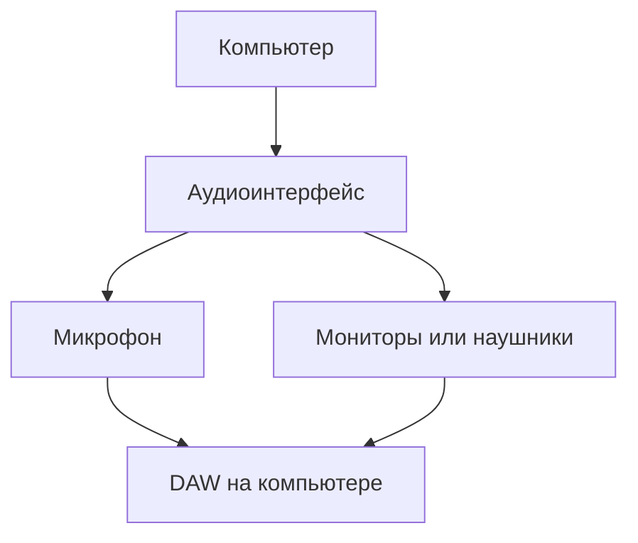

# Оборудование для домашней студии

Правильное оборудование — фундамент качества вашего звука. В этом разделе
мы разберём, что нужно купить в первую очередь, а на чём можно сэкономить.

## Минимальный набор

Для начала работы вам понадобится:



## 1. Аудиоинтерфейс

Аудиоинтерфейс — это мост между аналоговым миром (микрофоны, инструменты)
и цифровым миром (ваш компьютер).

### Ключевые характеристики

| Параметр | Что означает | На что смотреть |
|----------|-------------|----------------|
| **Входы** | Количество одновременных записей | Минимум 2 XLR |
| **Конвертеры** | Качество A/D и D/A | 24-bit / 96 кГц+ |
| **Latency** | Задержка звука | < 10 мс |
| **Preamp** | Чистота усиления | Низкий шум (< 1 дБА EIN) |
| **Подключение** | USB, Thunderbolt, PCIe | USB 3.0 для совместимости |

### Сравнение популярных интерфейсов

| Модель | Входы | Цена | Плюсы | Минусы |
|--------|-------|------|-------|--------|
| **Focusrite Scarlett 2i2** | 2× XLR/TRS | ~$180 | Надёжный, удобный софт | Средний preamp |
| **Universal Audio Volt 2** | 2× XLR/TRS | ~$170 | Встроенные плагины | Нет MIDI |
| **Behringer U-Phoria UM2** | 2× XLR/TRS | ~$60 | Дёшево | Шумный preamp |
| **Motu M2** | 2× XLR/TRS | ~$250 | Отличный DAC | Дороже |
| **RME Babyface Pro FS** | 4× XLR | ~$1400 | Лучший на рынке | Цена |

> [!TIP]
> Для старта достаточно **Focusrite Scarlett 2i2 (3-го или 4-го поколения)**.
> Это «рабочая лошадка» домашней студии.

## 2. Микрофоны

Тип микрофона определяет, что вы можете записывать.

### Типы микрофонов

| Тип | Принцип | Лучше всего для | Примеры |
|-----|---------|-----------------|---------|
| **Конденсаторный** | Ёмкостная мембрана | Вокал, акустические инструменты | Neumann U87, Rode NT1 |
| **Динамический** | Катушка в магнитном поле | Гитара, барабаны, громкие источники | Shure SM57, SM58 |
| **Ленточный** | Лента в магнитном поле | Струнные, духовые, «винтажный» звук | Royer R-121, sE RPC6 |

### Полярные диаграммы

- **Кардиоида (Cardioid)** — принимает звук спереди, подавляет сзади
- **Восьмёрка (Figure-8)** — принимает спереди и сзади
- **Всенаправленная (Omnidirectional)** — принимает со всех сторон

> [!WARNING]
> Конденсаторные микрофоны требуют **фантомного питания +48V**.
> Убедитесь, что ваш аудиоинтерфейс поддерживает эту функцию.

### Бюджетные рекомендации

| Бюджет | Микрофон | Применение |
|--------|----------|-----------|
| $50–100 | Audio-Technica ATR2100x | Универсальный (USB/XLR) |
| $100–200 | Rode NT1 (5th gen) | Вокал, студийный |
| $200–400 | sE Electronics X1 | Профессиональный вокал |
| $400+ | Neumann TLM 102 | Референсный вокал |

## 3. Мониторы и наушники

### Студийные мониторы

| Модель | Тип | Цена | Особенности |
|--------|-----|------|------------|
| **Yamaha HS5** | Active, 5" | ~$200/шт | Референсный стандарт |
| **KRK ROKIT 5** | Active, 5" | ~$170/шт | Бюджетный, тёплый |
| **Adam Audio T5V** | Active, 5" | ~$300/шт | Tweeter, детализация |
| **Focal Shape 65** | Active, 6.5" | ~$500/шт | Премиум за деньги |

### Студийные наушники

| Модель | Тип | Цена | Применение |
|--------|-----|------|-----------|
| **Audio-Technica ATH-M50x** | Closed-back | ~$150 | Запись, мониторинг |
| **Beyerdynamic DT 770 Pro** | Closed-back | ~$150 | Комфорт, изоляция |
| **Sennheiser HD 600** | Open-back | ~$300 | Сведение, референс |
| **Beyerdynamic Amiron** | Open-back, планарные | ~$500 | Критический слух |

> [!NOTE]
> **Closed-back** (закрытые) — лучше для записи, изолируют звук.
> **Open-back** (открытые) — лучше для сведения, естественная сцена.

## 4. Аксессуары

Неочевидные, но важные вещи:

| Аксессуар | Зачем | Бюджет |
|-----------|-------|--------|
| **Поп-фильтр** | Убирает щелчки при вокале | $10–20 |
| **Кабели XLR** | Подключение микрофонов | $15–30/шт |
| **Контроллер DAW** | Управление миди, темпом | $100–300 |
| **Антисимфон** | Стабилизация мониторов | $20/шт |
| **Обработка комнаты** | Акустические панели | $200–500 |

## Схема подключения

```mermaid
flowchart LR
    M[Микрофон] -->|XLR кабель| AI[Аудиоинтерфейс]
    G[Гитара] -->|1/4" кабель| AI
    AI -->|USB| PC[Компьютер с DAW]
    AI -->|TRS кабель| SP[Мониторы]
    AI -->|Jack 1/4"| HP[Наушники]
```

## Чек-лист для покупки

- [ ] Аудиоинтерфейс с минимум 2 входами XLR
- [ ] Конденсаторный микрофон для вокала
- [ ] Динамический микрофон для гитары/барабанов
- [ ] Студийные наушники (closed-back)
- [ ] Мониторы (если есть бюджет)
- [ ] XLR кабели (минимум 2 шт)
- [ ] Поп-фильтр
- [ ] Стенд для микрофона

---

**← [Назад: Что такое звук](osnovy-zvuka.md)** | **Далее: DAW →** [[daw.md]]
