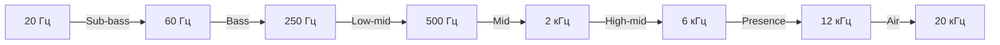

# Что такое звук

Звук — это **механическая волна**, распространяющаяся в среде (воздухе, воде,
твёрдых телах). В музыкальном производстве мы работаем с звуком в двух формах:

- **Аналоговая** — непрерывные колебания давления воздуха
- **Цифровая** — дискретные образцы (samples), записанные компьютером

## Физика звука

Любой звук описывается тремя основными параметрами:

### 1. Частота (Frequency)

Частота определяет **высоту тона**. Измеряется в Герцах (Гц) — количество
колебаний в секунду.

!!! note
    Диапазон слышимости человека: **20 Гц — 20 000 Гц (20 кГц)**.
    С возрастом верхняя граница снижается.

### 2. Амплитуда (Amplitude)

Амплитуда определяет **громкость** звука. Измеряется в децибелах (дБ).

| Значение дБ | Пример |
|------------|--------|
| 0 дБ | Порог слышимости |
| 30 дБ | Шёпот |
| 60 дБ | Обычный разговор |
| 90 дБ | Концерт |
| 120 дБ | Порог боли |
| 140 дБ | Взлёт реактивного самолёта |

#### Цифровые dBFS (Decibels Full Scale)

В цифровом аудио используется другая шкала — **dBFS** (децибелы относительно полной шкалы). В отличие от аналоговых дБ, здесь **0 dBFS — это максимум**, а все остальные значения отрицательны.

| Значение dBFS | Название | Описание |
|--------------|----------|---------|
| **-∞ dBFS** | Тишина (Silence) | Полное отсутствие сигнала |
| **-72 dBFS** | Шумовый пол 16-bit (Noise Floor) | Минимально различимый сигнал при 16-bit |
| **-60 dBFS** | Тихий сигнал | Фоновые шумы, тихие инструменты |
| **-24 dBFS** | Тихий рабочий уровень | Тихая речь, лёгкие инструменты |
| **-18 dBFS** | Номинальный уровень (Nominal Level) | Стандарт цифровой записи, точка отсчёта |
| **-12 dBFS** | Средний уровень (Average) | Средний уровень поп-музыки |
| **-6 dBFS** | Пиковый уровень (Peak) | Рекомендуемый максимум для headroom |
| **-3 dBFS** | Headroom минимальный | Последний безопасный пик перед клиппингом |
| **0 dBFS** | Full Scale (Клиппинг) | Максимум — выше идёт искажение |
| **+6 dBFS** | Over (в 32-bit float) | В 32-bit float сигнал может превышать 0 dBFS без клиппинга |

!!! tip "Почему шкала перевёрнута?"
    В аналоговом мире **0 дБ** — это тишина, а чем больше число, тем громче.
    В цифровом мире **0 dBFS** — это максимальная громкость, а всё,
    что "громче", обрезается (клиппинг). Поэтому шкала идёт от **-∞ до 0**,
    где **-∞** — полная тишина, а **0** — предел.

!!! note "Headroom — запас громкости"
    Headroom — это расстояние между пиковым уровнем сигнала и 0 dBFS.
    Профессиональные инженеры оставляют **3–6 dB headroom** при записи и сведении,
    чтобы пиковые моменты не клиппировали. Мастеризация часто "доводит" трек
    до -1...-0.5 dBFS для стриминговых платформ.

### 3. Форма волны (Waveform)

Форма волны определяет **тембр** — то, по чему мы различаем инструменты.

## Частотные диапазоны

Понимание частот — ключ к EQ и сведению. Вот основные диапазоны:

| Диапазон | Частоты | Что содержится | Примеры |
|----------|---------|---------------|---------|
| **Sub-bass** | 20–60 Гц | Ощутимый больше, чем слышимый | Sub-bass, kick bottom |
| **Bass** | 60–250 Гц | Низкие частоты | Бас-гитара, kick drum |
| **Low-mid** | 250–500 Гц | Тёплота, «муть» | Вокальный корпус |
| **Mid** | 500–2000 Гц | Ясность, присутствие | Вокал, гитара |
| **High-mid** | 2–6 кГц | Детали, атака | Снары, перкуссия |
| **Presence** | 6–12 кГц | Присутствие в миксе | Вокальная чёткость |
| **Air** | 12–20 кГц | Воздух, открытость | Шиммер, реверберация |

## Цифровое аудио

### Частота дискретизации (Sample Rate)

Количество измерений амплитуды в секунду.

| Sample Rate | Применение |
|------------|-----------|
| 44.1 кГц | CD-качество, стандарт для музыки |
| 48 кГц | Видео, кино |
| 96 кГц | Высокое разрешение, архивирование |
| 192 кГц | Профессиональный аудио |

!!! tip
    **Теорема Найквиста-Шеннона:** максимальная частота, которую можно
    точно записать, равна половине частоты дискретизации.
    При 44.1 кГц это ~22 кГц — достаточно для человеческого слуха.

### Битность (Bit Depth)

Количество бит для представления амплитуды каждого сэмпла.

| Bit Depth | Динамический диапазон | Применение |
|-----------|---------------------|-----------|
| 16-bit | ~96 дБ | CD |
| 24-bit | ~144 дБ | Запись, сведение |
| 32-bit float | ~1500+ дБ | Внутренняя обработка в DAW |

## Визуализация частотного спектра

## Практическое задание

!!! note
    **Задание 1:** Откройте любой аудиоплеер и включите любимый трек.
    Попробуйте определить, какие частотные диапазоны доминируют:
    bass, mid, или highs? Это разовьёт ваш слух для будущего сведения.

---

**← [Назад: Том I](index.md)** | **[Далее: Оборудование →](oborudovanie.md)**
