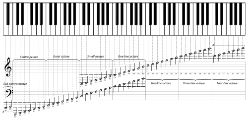

# Нотная грамота

## Что такое нота?

**Нота** — это звук с определённой частотой. В западной музыке используется
**12 нот** в октаве, после чего паттерн повторяется.

## 12 нот хроматической шкалы

| Нота | Частота (A4=440) | Английское название |
|------|-------------------|---------------------|
| C | 261.63 Гц | C |
| C# / Db | 277.18 Гц | C sharp / D flat |
| D | 293.66 Гц | D |
| D# / Eb | 311.13 Гц | D sharp / E flat |
| E | 329.63 Гц | E |
| F | 349.23 Гц | F |
| F# / Gb | 369.99 Гц | F sharp / G flat |
| G | 392.00 Гц | G |
| G# / Ab | 415.30 Гц | G sharp / A flat |
| A | 440.00 Гц | A |
| A# / Bb | 466.16 Гц | A sharp / B flat |
| B | 493.88 Гц | B |
| C (октава выше) | 523.25 Гц | C |

Пример: все 12 нот хроматической шкалы

<audio class="audio-player" controls preload="none" src="../../assets/audio/chromatic-scale.wav"></audio>

!!! note
    Нота **A4 = 440 Гц** — международный стандарт настройки.
    Каждая октава вверх удваивает частоту.

## Клавиатура пианино

На клавиатуре пианино (и в любой DAW) ноты расположены так:



- **Белые клавиши** — натуральные ноты (C D E F G A B)
- **Чёрные клавиши** — диезы/бемоли (C# D# F# G# A#)

## Мажорная гамма

Мажорная гамма строится по формуле тонов и полутонов:

```
Тон — Тон — Полутон — Тон — Тон — Тон — Полутон
(T   — T   — ST    — T   — T   — T   — ST)
```

Гамма C мажор (без диезов и бемолей):

```
C → D → E → F → G → A → B → C
```

<audio class="audio-player" controls preload="none" src="../../assets/audio/c-major-scale.wav"></audio>

## Интервалы

**Интервал** — расстояние между двумя нотами.

| Интервал | Ноты от C | Характер | Пример |
|----------|-----------|----------|--------|
| Унисон | C → C | Та же нота | <audio class="audio-player" controls preload="none" src="../../assets/audio/interval-unison.wav"></audio> |
| Малая секунда | C → C# | Натяжение | <audio class="audio-player" controls preload="none" src="../../assets/audio/interval-minor-2nd.wav"></audio> |
| Большая секунда | C → D | Шаг | <audio class="audio-player" controls preload="none" src="../../assets/audio/interval-major-2nd.wav"></audio> |
| Малая терция | C → D# | Мрачность | <audio class="audio-player" controls preload="none" src="../../assets/audio/interval-minor-3rd.wav"></audio> |
| Большая терция | C → E | Радость | <audio class="audio-player" controls preload="none" src="../../assets/audio/interval-major-3rd.wav"></audio> |
| Кварта | C → F | Открытость | <audio class="audio-player" controls preload="none" src="../../assets/audio/interval-perfect-4th.wav"></audio> |
| Квинта | C → G | Стабильность | <audio class="audio-player" controls preload="none" src="../../assets/audio/interval-perfect-5th.wav"></audio> |
| Октава | C → C | Повторение | <audio class="audio-player" controls preload="none" src="../../assets/audio/interval-octave.wav"></audio> |

---

**← [Назад: Том II](index.md)** | **[Далее: Аккорды и гармония →](akkordy.md)**
